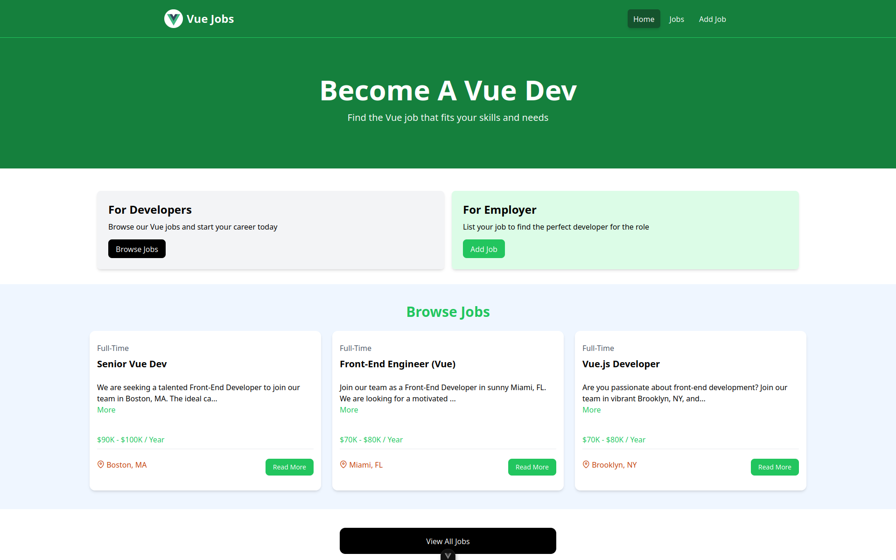

# Vue Work Project

## 📄 Description

This project is built using **Vue.js**, **Tailwind CSS**, and **JSON Server**.  
Below is a preview of the main page:



---

## 📥 Download Instructions

You can get the project in two ways:

### 1. Download as ZIP  
Go to the GitHub repository, click the **Code** button, and select **Download ZIP**:  
👉 [https://github.com/kashef-ir/vue-work](https://github.com/kashef-ir/vue-work)

### 2. Clone via Git  
Use the following command in your terminal:

```bash
git clone https://github.com/Kashef-ir/Vue-work.git
```

### 🚀 How to Run the Project
#### 1. Start the Vue Development Server

Run the following command inside the project directory:
```bash
npm run dev
```
You should see a local server URL (e.g., http://localhost:5173) in the terminal.
#### 2. Start the JSON Server

To render job data from the JSON Server, run:
```bash
npm run server
```

### ✅ Requirements

Node.js and npm installed

Internet connection for installing dependencies
